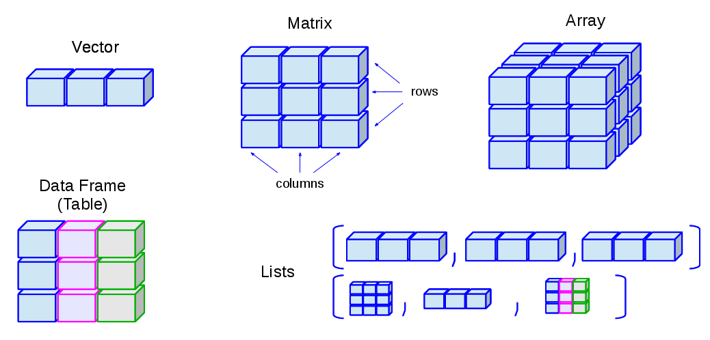
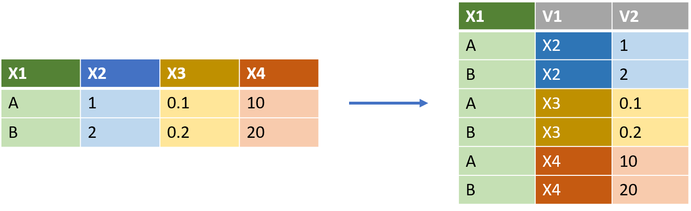

```{r setup, include=FALSE}
knitr::opts_chunk$set(echo = FALSE)
library(knitr)
```

## Summary

* What is R
* What can I do with R 
* Working with R in Rstudio
* R basic characteristics
* Visualizing data with ggplot
* Data carpentry
* Writing Functions

# Introduction

## What is R

> R is a **free software environment** for statistical computing and graphics, available at <https://cran.r-project.org/> 


* **open source** → huge community
* **statistical computing** → data mining/analysis
* **graphics** → data mining/visualization
* **programming** → language (command-line interpreter)


## Why R

### Pros
1. It's free!
2. Almost everything is ready
3. It easy to find "how to"s on the web 

### Cons
1. Bugs errors and inconsistencies
2. It is not a true programming language
3. not always user friendly

## R Packages

* New functionalities are added to R by using **packages**. 
* A package is a set of __documented__ functions to solve specific tasks

### Package sources
* CRAN - <https://cran.r-project.org/>
* Bioconductor - <https://www.bioconductor.org/>
* GitHub - <https://github.com/>

## Packages on CRAN

```{r, echo=FALSE, fig.align='center', out.width="90%"}
include_graphics("images/packages.png")
```


## RStudio
```{r, echo=FALSE, fig.align='center', out.width="70%"}
include_graphics("images/rstudio.png")
```


## RStudio
```{r, echo=FALSE, fig.align='center', out.width="90%"}

```


## How do we work

### Organize your work
* Keep track of what you do in the text editor
* Execute the commands in the console
* **Save** your code for next time ;-)

### Store your scripts
* **.R** files with this extension can be executed by R. The comments are marked by #
* **.Rmd** these files are typical of RStudio and consist of a mixture of text and code *chunks*

***


## Key idea #1: Working directory

Is your reference directory

* reading files (data or code)
* writing files
* saving objects


```{r echo=TRUE, eval=FALSE}
## this function gets the working directory
getwd()
```


## Key idea #2: Workspace

Is the place (in memory) where R stores all the stuff you can use for the analysis. 

* functions
* variables
* saving objects

R will "see" only things that are in the workspace!


## Populating the workspace

To put something in the workspace one uses either the "->" or "="

```{r echo=TRUE, eval=FALSE}
## this line of code creates a place called "a" 
## in the workspace, filling it with the number 3

a <- 3

```

The content will show up in the "Environment" tab of Rstudio ...

# R basics in a nutshell

## Basic data Types

R can understand several basic **data types**

* Numeric: number with the comma
* Integer: number without comma
* (Complex number)
* Logical: TRUE/FALSE
* Character: a sequence of characters, everything between " "

## Assignment

\footnotesize
```{r eval=FALSE, echo=TRUE}
## create a set of basic objects 
## operate on them with basic operations (+,-,*,/) 
## to create character vectors use " ". 

a <- 1
b <- 2

c <- a+b

```
\normalsize

### Question time
* can you combine object of different type?
* what does it happen if you sum two logical variables?
* is 1 different from "1"?


## Multidimensional Objects

Multidimensional objects are constructed by collecting together multiple basic data types

```{r, echo=FALSE, fig.align='center', out.width="70%"}

```


The elements (or the rows and columns) can be also **named**


## Functions

Functions can be seen as "digestors", which handle some input producing output. 

\footnotesize
```{r eval=FALSE, echo=TRUE}
## a name followed by parenthesis is a function ...

pippo()
```
\normalsize

Inside the parenthesis you have **arguments** which determine the behavior of a function

\footnotesize
```{r eval=FALSE, echo=TRUE}
## what does this do?
d <- sqrt(9)

## and this?
p <- seq(from = 1, to = 5, by = 2)
```
\normalsize

## Getting Help

The possible arguments of a function can be checked in the extensive and complete R help

```{r eval=FALSE, echo=TRUE}
## shows the help for the seq function
?seq
```


## Functions and multidimensional objects


**Multidimensional objects** are created by specific **functions**, with really evocative names ;-)

\tiny
```{r, echo=TRUE}
## create
myvector <- c(1,2,3,4)
mymatrix <- matrix(seq(1,9), ncol = 3)
mydataframe <- data.frame("col1" = 1:3, 
                          "col2" = c("one","two","three"))
mylist <- list("hey" = seq(1:30), "today" = "monday")

## show
mymatrix

mydataframe
```

## Factors

Factors are character vectors with a limited number of values. For parsimony they are saved as numbers ...

\footnotesize
```{r echo = TRUE}
myfactor <- factor(rep(c("treated","ctrl"), each = 3))
myfactor
```
\normalsize

> **Important** if not specified the levels of the factor are ordered in alphabetical order. The importance of this aspect will be clear when we will start dealing with plots


## Accessing Multidimensional Objects

### 
* by **position**, giving the "coordinates"
* by **name** (more robust)

## Arrays, matrices and data frames

\footnotesize
```{r eval=FALSE, echo=TRUE}
# like coordinates ... 
mydataframe[1,]  ## first row 
mydataframe[,1]  ## first column
mydataframe[,"col1"] ## the column  "col1"

# slicing
mydataframe[1:4,1]  ## the first four rows of the first column


# for data frames, the '$' symbol 
# can be used to access the columns in a faster way
mydataframe$col1
```

## Lists

Lists are substantially unidimensional so we need only one index or one name

\footnotesize
```{r eval=FALSE, echo=TRUE}
## here we need double brackets to get the element

mylist[[1]]  # the first element
mylist[1:3]  # from the first to the third element

mylist[["pippo"]] # the element named pippo 

mylist$pippo  # also here the elemnt named pippo

```

## Assignment #2

\small
```{r eval=FALSE, echo=TRUE}
# 1. create a dataframe with two columns, 
# one with the short name of each month, 
# the second with the number of days, the third with the (approximate) season
# 2. extract the season and transform it into a factor
# 3. do the same with a list

data.frame()
factor()
list()
```


## Packages
The functionlities of R are expanded by "packages". Packages contain functions and, optionally data. To make a package available you have to

* download and compile it on your machine
* load it in the workspace

\vspace{1em}

\tiny
```{r eval=FALSE, echo=TRUE}
# install the package from CRAN on my machine
install.packages("tidyverse") 

# makes the tools present in the package available on my workspace 
library(tidyverse) 

# load the mpg dataset in my workspace, otherwise I will not be able to use it!
data(mpg)
```


# Wrangling data tables

## My first Data visualization task
{width=50%}


## Mind Map of data wrangling


## Tabular and tidy data


we can think of them as enormous and complicated excel tables

## mpg dataset

This dataset contains a subset of the fuel economy data that the EPA makes available on http://fueleconomy.gov. It contains only models which had a new release every year between 1999 and 2008 - this was used as a proxy for the popularity of the car.
\vspace{1em}
\tiny
```{r message=FALSE, warning=FALSE, echo=TRUE}
## load the library
library(tidyverse)
## load the data
data(mpg)
## show their header, first 5 lines
head(mpg,5)
```


## Fast summary of my data

\tiny
```{r, echo=TRUE}
## this function gives a convenient summary of the data
summary(mpg)
```

## A plot! 

```{r}
ggplot(data = mpg) + 
  geom_point(mapping = aes(x = displ, y = hwy, col = class), size = 3, alpha = 0.5) +
  theme_light() +
  theme(aspect.ratio = 0.5)
```

## How we did it ..

\footnotesize
```{r eval=FALSE, echo=TRUE}
ggplot(data = mpg) + 
  geom_point(mapping = aes(x = displ, y = hwy, col = class), 
             size = 3, 
             alpha = 0.5) +
  theme_light() +
  theme(aspect.ratio = 0.5)
```
\normalsize
\vspace{1em}

**Note** Here the functions are linked by **+**, this way of writing has been used to introduce a so called "grammar" of graphics

## Dissecting the command

\scriptsize
```{r eval=FALSE, echo=TRUE}
## create an emty canvas ready for mpg
ggplot(data = mpg) +
  ## on the canvas plot points linking their eastetics to the column names
  geom_point(mapping = aes(x = displ, y = hwy, col = class),  
             size = 3, 
             alpha = 0.5) +
  ## add additional general aestetics
  theme_light() +  ## simple colors                
  theme(aspect.ratio = 0.5) ## plot aspect ratio
  
```
\normalsize

* `ggplot()`  - create the plot area
* geom_*something*() - add graphic elements to the plot
* `aes()` function to map graphical properties to columns in the data


## Now a density plot!
```{r}
ggplot(data = mpg) + 
  geom_density(mapping = aes(x = displ, fill = class), alpha = 0.5) +
  theme_light() +
  theme(aspect.ratio = 0.5)
```

## On ggplotting

* manipulate "global" properties outside `aes()`
* link them with column inside `aes()`
* find the required and optional aesthetics in the help (e.g. `?geom_point`) 


**Mind the apex!**
\vspace{1em}
\scriptsize
```{r eval=FALSE, echo = TRUE}
## when you specify the names of the columns 
## pay attention to the apex!

 "ciao" # - string
 'ciao' # - string
 `ciao` # - the "name" ogf the column
```

***


## Assignment #3

1. Play around with mpg changing the type of plots 
2. Associate aesthetics to categorical or continuous properties
3. Make a boxplot of "displ" as a function of the class of the vehicle
4. Just play and ask!

## Splitting the plot in subplots
```{r}
## group specific subplots
ggplot(data = mpg) + 
  geom_point(mapping = aes(x = displ, y = hwy, col = class), 
             alpha = 0.5, size = 2) +
  facet_wrap(~class) + 
  theme_light() +
  theme(aspect.ratio = 0.5)
```

## Here the trick
\scriptsize
```{r eval=FALSE, echo = TRUE}
## group specific subplots
ggplot(data = mpg) + 
  geom_point(mapping = aes(x = displ, y = hwy, col = class), 
             alpha = 0.5, size = 2) +
  facet_wrap(~class) +  ## !!!!!!!!!!!!!!!!!!!!!!!!!!!!!!!! 
  theme_light() +
  theme(aspect.ratio = 0.5)
```
\normalsize
\vspace{1em}
> `facet_wrap()` and `facet_grid()` can be used to split the content of a plot
> according to one or more categorical variables

Faceting can be also used with a clever trick to display multiple variables in the same multiplot ...

## Long and Wide data.frames
The same *tidy* data.frame can be organized in a **wide** and a **long** format. 
Topically we prefer to work with wide data, but long formats can be extremely handy ...



***

```{r}
mpglong <- gather(mpg, 
                  key = "Property",
                  value = "Value",
                  displ,cty,hwy)

ggplot(mpglong) + 
  geom_jitter(aes(x = class, y = Value, col = class), width = 0.1) + 
  geom_boxplot(aes(x = class, y = Value, fill = class), alpha = 0.5) + 
  facet_wrap(~Property, scales = "free") + 
  coord_flip() + 
  theme_light() + 
  theme(aspect.ratio = 1)
```

***


## Edgar Anderson's Iris Data
This famous (Fisher's or Anderson's) iris data set gives the measurements in centimeters of the variables sepal length and width and petal length and width, respectively, for 50 flowers from each of 3 species of iris. 

The species are Iris **setosa, versicolor, and virginica**.
\vspace{1em}
\scriptsize
```{r echo=TRUE}
## you get it with 
data(iris)
## visualize data
head(iris,5)
```

## Assignment #4
1. Look for correlation between  Sepal.Length and Sepal.Width (Petal.Length and Petal.Width) for the three iris varieties
2. Make a faceted boxplot showing the four iris properties as a function of the species  

## Read and Write data

### Reading 
* in RStudio directly import data tables with the *Import Dataset* command present in the `Environment` tab
* from the command line several `read` function are available
* to avoid strange behavior keep your files as simple (tidy!) as possible ... no colors, no merged cells, ...

### Writing
* the object in the environment can be saved in compressed `.RData` format
* tables can be written with `write.csv`, `write.table` (or `write_csv` and `write_table` from the `readr` package)
* the function from `readr` are more efficient and handle better the row names

## Example
\tiny

```{r echo=TRUE, eval=FALSE}
## save obj1 and obj2 in the mydata.RData file ...
save(obj1,obj2,file = "mydata.RData")
```

\vspace{2em}

```{r message=FALSE, warning=FALSE, echo=TRUE}
library(readr)
## here the data are in a csv called "wines.csv"
wines <- read_csv("data/wines.csv")

head(wines,5)
```
\normalsize
List of Chemical properties of a group of three types of wines (Barolo, Barbera and Grignolino)


## Assignment #5
1. Get the wines data from GitHub (wines.csv)
2. Import the data into R
3. make a text summary of your data (`summary()`)
4. Plot the relation between proanthocyanidins and total phenols for the three types of wines.
5. Can you do a boxplot of the different properties of the wines (also here remember wide and narrow data.frames)?


# Data Carpentry

## Data Carpentry

> With the term "data carpentry" we identify all the set of operations/manipulations we currently do during the process of data exploration

\vspace{1em}

### Typical Operations
* Select some columns (variables)
* Select some rows 
* Transform some of the columns (e.g. sum them …)

* Calculate some statistics on a group of samples

## The old way ...

In the “standard” data analysis workflow, when several steps of transformation are needed the output of each transformation are saved and become the input of the subsequent step.
This is time and memory inefficient ...
\vspace{1em}
\scriptsize
```{r eval = FALSE, echo=TRUE}
## suppose you want to make a sequence from 1 to the square root of 10
a <- 10
b <- sqrt(a)
c <- seq(1,b,1)

## we create intermediate ancillary objects 
```

## Piping

Better would be to “pipe” the output of a function to the input of another function ...
no intermediate saving, but also a code easier to read ...

\vspace{1em}
\large
```{r echo=TRUE, eval=FALSE}
## pipe
%>%
```

\normalsize
\vspace{1em}

This is the “pipe” operator which is added to R when you use tidyverse (actually magritteR ...) 

## Plumber at work ...

\scriptsize
```{r echo=TRUE, out.width="60%", fig.align = "center"}

wines %>% 
  filter(class == "Barolo") %>%       ## get only the Barolos
  ggplot() +                          ## the data comes from the pipe!
  geom_point(mapping = aes(x = alcohol, y = malic_acid), 
             col = "steelblue", size = 4) + 
  theme_light()

```

## Pipes

###
* Very compact and clear writing
* I’m not creating permanent intermediate objects
* It follows my “psychological” logic ... I’m not changing the data, but only digesting them ...

## First carpenter tools

###
* \textcolor{blue}{select()} Used to include, exclude columns. to exclude just put a (-) before the name.
* \textcolor{blue}{filter()} Used to focus only a subset of the rows depending on a criterion
* \textcolor{blue}{mutate()} Used to modify the content of a column or combine columns together

***


## Assignment #6
1. Load the iris data 
2. Calculate the ratios sepal.width/sepal.length and petal.width/petal.length (with **mutate()**!)
3. Plot the two ratios for all the iris variety
4. Save the modified table as .csv
5. Open it with Excel and see if you managed to save the new columns

**Important** Everything should be done with pipes! So only one command!


# Manipulating the graph aesthetics

## Axis labels and scales
As expected the axis labels in `ggplot` can be manipulated by "adding" functions to the ggplot chain
\vspace{1em}
\tiny
```{r echo=TRUE, fig.height=4, fig.width=7, out.width="50%",  fig.align = "center"}
ggplot(data = mpg) + 
  geom_point(mapping = aes(x = displ, y = hwy, col = class), 
             alpha = 0.5, size = 2) +
  ylab("Highway (miles/gallon)") + xlab("Engine size (l)")   

# other additions xlim(...),ylim(...), scale_x_log10(...), scale_x_reverse(...)
```

## `scale_x_continuous(...)`

\tiny
```{r, echo=TRUE, eval=FALSE}

scale_x_continuous("Label",                             ## Label of the axis
                   limits = c(2, 6),                    ## limits ... is a vector
                   breaks = c(2, 4, 6),                 ## where are the breaks?
                   label = c("two", "four", "six")      ## custom names?
                   )


```


## Themes


* The overall appearence of the graph can be  higly customized, however some precooked solutions are already available within `ggplot`
* [ggplot theme list](https://ggplot2.tidyverse.org/reference/ggtheme.html)
* A lower level control can be achieved by using the `theme(...)` function 
* More themes are available within the `ggtheme` pachage

\vspace{1em}
\scriptsize

```{r echo=TRUE, eval=FALSE}
## just as a reminder
install.packages("ggthemes")
library(ggthemes)
```


## Plotting colors
A good choice of colors is fundamental to highlight the scientifica message of every plot. 

* We are not good in distinguishing too many differnt colors
* The level "visual" similarity of the colors will be implicitly perceived as sample similarity
* Do we need a B&W representation?
* Do we want to be "color blind" safe?

## Nice color schemas

In R colr names are specified as strings either by name or by hexadecimal color (`#e5f5f9`). An additional number between 0 and 99 can be added to the hexadecimal code to make the color trasparent. 
Fr example, `#e34a33` is a type of **red**.  `#e34a3350` is the same color, but half transparent.

* [Color Brewer](http://colorbrewer2.org/#type=sequential&scheme=BuGn&n=3) available in R in the package `RColorBrewer`
* [`colortools` package](http://www.sthda.com/english/wiki/the-elements-of-choosing-colors-for-great-data-visualization-in-r). It allows the definition of specific color schemes starting from a chosen color.

## Setting the colors

\scriptsize
```{r echo = TRUE, eval=FALSE}
## Setting manually the scale (discrete)
scale_color_manual(values=c("#999999", "#E69F00", "#56B4E9"),## the colors
                   name = "myname")  ## the name of the colorscale
scale_fill_manual(...)

## 'fill' and 'color' indicate what type of aesthetics is affected


scale_color_brewer(...) 
scale_fill_brewer(...)
## make the brewer colorschemes directly available in ggplot

```

---

\scriptsize
```{r echo = TRUE, eval=FALSE}
## Setting manually the scale (cotinuous)

scale_colour_gradient(low = "white", 
                      high = "black")
##the same holds for fill

scale_colour_gradient2(low = "red", 
                       mid = "white",
                       high = "blue", 
                       midpoint = 0, 
                       name = "myscale")

## here we have three colors and we can set the value of the midpoint
```


## The Olympic Games Dataset

\tiny

This is a historical dataset on the modern Olympic Games, including all the Games from Athens 1896 to Rio 2016. I scraped this data from [sports-reference](www.sports-reference.com) in May 2018. 

Note that the Winter and Summer Games were held in the same year up until 1992. After that, they staggered them such that Winter Games occur on a four year cycle starting with 1994, then Summer in 1996, then Winter in 1998, and so on. A common mistake people make when analyzing this data is to assume that the Summer and Winter Games have always been staggered.

Content
The file athlete_events.csv contains 271116 rows and 15 columns. Each row corresponds to an individual athlete competing in an individual Olympic event (athlete-events). The columns are:

* ID - Unique number for each athlete
* Name - Athlete's name
* Sex - M or F
* Age - Integer
* Height - In centimeters
* Weight - In kilograms
* Team - Team name
* NOC - National Olympic Committee 3-letter code
* Games - Year and season
* Year - Integer
* Season - Summer or Winter
* City - Host city
* Sport - Sport
* Event - Event
* Medal - Gold, Silver, Bronze, or NA

```{r message=FALSE, warning=FALSE, include=FALSE}
## Olympic games data
athl <- read_csv("data/athlete_events.csv")
```


***


## Assignment #7

* Get the "Olympic Game Dataset" from Github
* Consider the athlets which were getting a medal in the Athletics Men's 100 metres
* Do we see a trend in Age, Height, Weight over the years?
* Can you do the same for the BMI (body mass index)
* Do you see the same trend for Downhill Alpine Skiing?
* Do you see the same trend for a discipline of endurance like marathon?


## Grouping and summarising

\footnotesize
* `group_by()`: this function can be used inside a pipe to group the samples on the bases of a set of discrete variables. Grouping can be removed from a tibble by using the `ungroup()` function
* `summarise()`: this function can be used apply some sort summary function (e.g. mean, median, sd, ...) on the grouped data frame. summarise can be used also to calculate multiple statistics

\vspace{1em}
\scriptsize
```{r echo = TRUE, eval = FALSE}
## single summarise
summarise(mymean = mean(var), ## what function should be applid. 
          n = length(var))    ## another summary function    
```

\footnotesize
To summarize more than one columns grouping should be combined with `gather` ;-)


***


## Assignment #8

* Get the "Olympic Game Dataset"
* List the athlets who won more than 4 gold medals in at least one summer olympic games
* Save the list with their info in a file and lod it in Excel

## Average Age in Athletics
\tiny
```{r, echo=TRUE, out.width="50%", fig.align = "center"}
athl %>% 
  filter(Sport == "Athletics") %>% 
  filter(Sex == "M") %>% 
  group_by(Year) %>% 
  summarise(avg_age = mean(Age, na.rm = TRUE)) %>% 
  ungroup() %>% 
  ggplot() + 
  geom_line(aes(x = Year, y = avg_age), col = "steelblue") + 
  geom_point(aes(x = Year, y = avg_age), col = "orange", alpha = 0.5, size = 3) + 
  ylab("Average Athlete Age") + 
  theme_light()
```

## Assignment #9

* Get the "Olympic Game Dataset"
* Make a plot showing the trend of the average BMI of the participants/medal winners for a set of running disciplines of increasing length (100m, 200m, 400m, 800m, 1500m, 5000m, 10000m, marathon)

Note: some helpful code hits are included in practical_3


# Functions

## Functions

* Functions are the workhorse of all programming languages
* Almost everything we have been doing so far is actually performed by functions
* The packages are basically extending the language capabilities by adding new functions


## Why should one write a function?

* If I do several time the same operation a function saves me time
* If I do several time the same operation a function prevents me of making copy/paste errors

## Anatomy of a function

```{r eval=FALSE, echo=TRUE}
## this is the anatomy of a function called pippo

pippo <- function(inputs){
  ## here I do something on the inputs
  output <- something(input)
  return(output)
}


## after the previous definition I can use pippo as

a <- pippo(b)

```

## Notes
### Remember!

* it is wise to use meaningful names ;-) (not pippo)
* the function can have multiple inputs
* the function can output only one R object (if you want complex output you should wrap them into a list)
* the variable created inside the function are not living in the workspace. Their **scope** is limited. 

***


## Assignment #10

* Create a function which calcuate the average value of anumeric vector
* Create a function which scales a vector to the interval [0,1]. So the minimum of the vector should be shifted to zero and the maximum scaled to one.

## *if* statements

```{r eval=FALSE, echo=TRUE}
## If statements are often used condition the output of the functions
## The if command in R looks like 

if (condition) {
  # do this
} else {
  #do that
}
```

***


## Assignment #11

* Create a function which calculates the absolute value of a number
* Create a function which check if the length of a vector is even or odd

## Function arguments

As we have anticipated, functions can have multiple inputs (**arguments**) which can be used to tune the behavior of the function, adapting it to different use cases. 
Arguments have, in general, default values which are defined during the function definition

\scriptsize
```{r eval=FALSE, echo=TRUE}

pippo <- function(a, b = 10, c = "ciao"){
  ## b and c are have default values, If they are not explicitly 
  ## changed the function will work with them
  ## here I do something on the inputs
  output <- something(a,b,c)
  return(output)
}

pippo(10) ## a is set to 10, b and c keep their default values
pippo(10, b = 9) ## a is 10, b is now  9, while c keeps "ciao"

```

## Assignment #12

* Create a function which calculates either the mean or the standard deviation of a vector. The choice should be performed by setting a specific argument in the function call
* Create a function which calculate the mean of a numeric vector excluding missing values.
* Use your function to calculate the mean inside a `summarise()` call in your analysis pipeline for the Assignment #9


